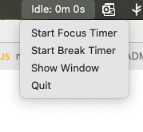
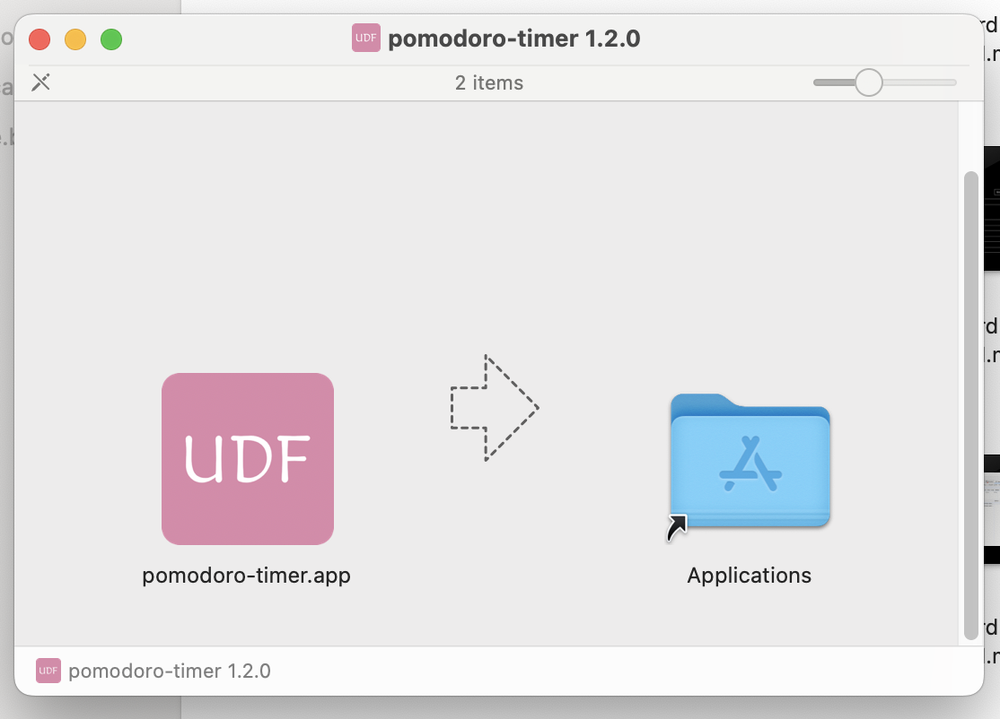
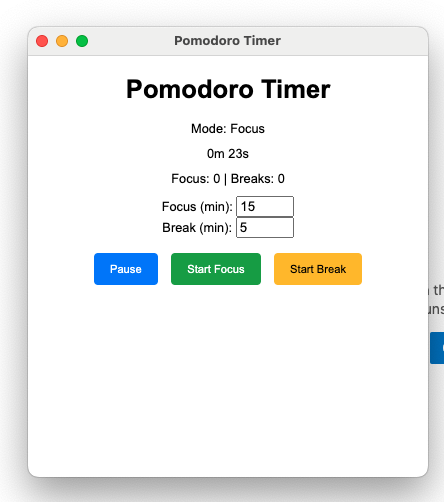
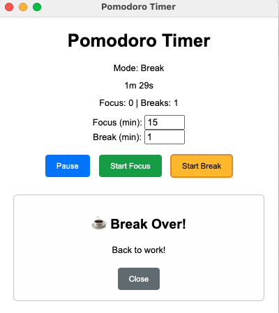

# Pomodoro Timer ⏰

A simple, desktop-based Pomodoro timer built with Electron.


---

## 🧠 Features

- 🕒 Focus & break sessions with sound alerts  
- ⏸ Pause and resume support  
 <!-- optional -->
- 🔊 Loud notifications with system popups  
- 🪟 Tray icon with controls  
- ⚙️ Custom timer durations via UI  
- 🧩 Built with Electron  

---

## 🚀 Download

➡️ [Download latest release](https://github.com/jovylle/py-pomodoro/releases/latest)

> ✅ Mac `.dmg` installer available

 <!-- optional -->

 <!-- optional -->

 <!-- optional -->
---

## 🛠 Run from source

```bash
git clone https://github.com/jovylle/py-pomodoro.git
cd py-pomodoro
npm install
npm start
````

---

## 📦 Create Dev Snapshot ZIP

To zip only the core files (`main.js`, `renderer.js`, `package.json`, `index.html`) with today’s date and time:

```bash
zip -r "py-pomodoro-$(date +%Y-%m-%d-%H-%M).zip" main.js renderer.js package.json index.html
```

> Example Output: `py-pomodoro-2025-06-16-12-54.zip`

---

## 🧱 Build `.dmg` Installer (Mac)

```bash
npm run dist
```

> Make sure your `package.json` includes the following:

```json
"build": {
  "appId": "com.jovylle.pomodoro",
  "mac": {
    "target": "dmg"
  }
}
```

> Requires `electron-builder`, already listed in devDependencies.

Output will be in the `dist/` folder.
You can then upload the `.dmg` to GitHub Releases.


## 🧰 System Requirements

> This app is currently built for **macOS** only.

### Minimum:

* macOS 11 (Big Sur) or later
* Intel or Apple Silicon (M1/M2)
* Node.js ≥ 16
* npm ≥ 7

### Optional (for developers):

* Xcode Command Line Tools (for building `.dmg` installer)
* `iconutil` and `sips` (default on macOS)

> 💡 Windows & Linux support not yet included, but can be added with Electron cross-platform packaging.
